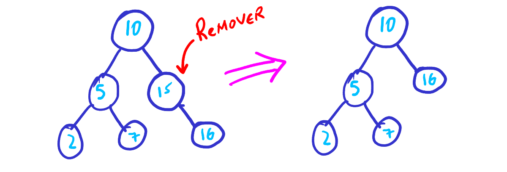
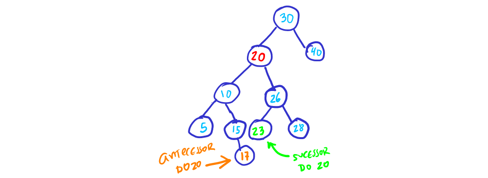
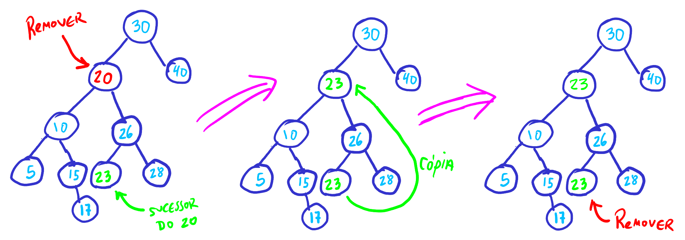

% Tópico 8: *Árvores* - Conceitos Gerais, Árvores Binárias e Árvores de Busca Binária
% Prof. Dr. Juliano Henrique Foleis

Estude com atenção os vídeos e as leituras sugeridas abaixo. Os exercícios servem para ajudar na fixação do conteúdo e foram escolhidos para complementar o material básico apresentado nos vídeos e nas leituras. Quando o exercício pede que crie ou modifique algum algoritmo, sugiro que implemente-o em linguagem C++ para ver funcionando na prática.

# Vídeos

[Árvores: Conceitos Gerais](https://youtu.be/zE1FMszj_1c)

[Árvores Binárias: Estrutura e Percursos](https://youtu.be/l6SGErZpHro)

[Árvores de Busca Binária: Busca e Inserção](https://youtu.be/dzTCB5HthBQ)

# Explicação da Remoção em uma ABB

A remoção de um nó de uma árvore de busca binária deve ser realizada de forma que a árvore permaneça respeitando as propriedades de uma árvore de busca binária após a remoção. Existem 3 casos a considerar:

1. O nó a ser removido é folha;
2. O nó a ser removido tem um único filho; e
3. O nó a ser removido tem dois filhos.

## Remoção de um Nó Folha

No caso que o nó a ser removido é folha, basta desalocá-lo, e fazer quem estava apontando pra ele passe a apontar para nada (NULL), como mostrado na Figura 1.

## Remoção de um Nó com Apenas um Filho

Neste caso, basta fazer quem apontava para o nó a ser removido passe a apontar para o único filho do nó sendo removido. Finalmente, o nó sendo removido deve ser desalocado. Este processo está representado na Figura 2.

## Remoção de um Nó com Dois Filhos

Este caso é um pouquinho mais complicado. Temos que considerar que os 2 filhos podem não ser folhas, ou seja, podem ter sub-árvores "penduradas"! 

Vamos chamar o nó a ser removido de $x$. Como a árvore é uma árvore de busca binária, toda chave em $x$.esq é menor que $x$ e toda chave $x$.dir é maior que $x$. Logo, a maior chave de $x$.esq também é menor que toda chave em $x$.dir. Portanto, se a maior chave de $x$.esq for colocada no lugar de $x$, a árvore continuará sendo uma ABB. O maior elemento de $x$.esq é chamado de *antecessor de x*. Da mesma forma, a menor chave de $x$.dir é maior que toda chave em $x$.esq. Da mesma forma, se a menor chave de $x$.dir for colocada no lugar de $x$, a árvore continuará sendo uma ABB. O menor elemento de $x$.dir é chamado de *sucessor de x*. A Figura a 3 mostra o antecessor e o sucessor de 20 em uma árvore.

Como visto na Figura, o antecessor é o maior valor da sub-árvore enraizada em $x$.esq. Como os itens em sub-árvores à direita são sempre maiores que sua raíz, o maior item de uma sub-árvore é sempre o ultimo elemento em um percurso que segue os ponteiros à direita. Dessa forma, o antecessor de $x$ é encontrado seguindo o percurso dos ponteiros à direita de $x$.esq. Por exemplo, o antecessor de 20 na Figura 4 é encontrado seguindo o caminho $esq \rightarrow dir \rightarrow dir$ a partir do nó com chave 20.

Da mesma forma, o sucessor é o menor valor da sub-árvore enraizada em $x$.dir. Ele pode ser encontrado seguindo o percurso dos ponteiros à esquerda de $x$.dir. Por exemplo, o sucessor de 20 na Figura a seguir é encontrado seguindo o caminho $dir \rightarrow esq$ a partir de do nó com chave 20.

Portanto, para remover $x$, podemos colocar o antecessor ou o sucessor de $x$ no lugar de $x$. Para deixar a simplificação mais enxuta, a explicação a seguir considera que $x$ está sendo substituído por seu sucessor. A Figura 4 mostra o processo de remoção. Primeiro, o sucessor $s(x)$ é encontrado. Os dados de $s(x)$ substituem os dados de $x$ no nó $x$. Neste momento, os dados de $s(x)$ estão replicados, como mostra a Figura 4. Agora basta remover o nó $s(x)$ original. A remoção de $s(x)$ pode ser feita usando a mesma rotina de remoção, e, por definição, $s(x)$ tem no máximo um filho. Portanto, sua remoção é trivial, conforme abordado acima.

# Leitura Sugerida

FEOFILOFF, Paulo. Estruturas de Dados. *Árvores binárias de busca (BSTs)* [(Link)](https://www.ime.usp.br/~pf/estruturas-de-dados/aulas/st-bst.html)

# Exercícios Teóricos

Exercícios 1.1, 1.2, 1.3, 1.4, 1.5, 2.1, 2.2, 2.3, 5.1, 5.3 da página do Prof. Feofiloff (Árvores binárias de busca (BSTs)): [(Link)](https://www.ime.usp.br/~pf/estruturas-de-dados/aulas/st-bst.html)

# Exercícios Práticos

**1.** Baixe a implementação criada em sala de aula no [link](https://github.com/julianofoleiss/BCC4001-guias/tree/4178e3ceb8cb4c6add8cc29df2ffd58dac8adeec/08.%20arvores%20e%20arvores%20de%20busca%20bin%C3%A1ria/abb). Implemente as funções a seguir na classe ABB:

**a.** Implemente os destrutures das classes `NoABB` e `ABB`. **ATENÇÃO**: você deve alterar o método `ABB::removerNo` para que ele anule `no->dir` ou `no->esq` (no caso 2, de acordo com a situação) antes de desalocar o nó. Caso contrário, você terá problemas ao destruir a árvore (por quê?). 

**b.** Implemente a função `imprimir()` de forma que produza a saída mostrada no [vídeo](https://youtu.be/dzTCB5HthBQ?t=1960).

**c.** Implemente a função recursiva `tamanho()` que devolve o número de nós de uma árvore binária. Você pode criar um método privado auxiliar, conforme fizemos para implementar a inserção e a remoção.

**d.** Implemente a função recursiva `altura()` que calcula a altura da árvore. Sua implementação deve ser preguiçosa (*lazy*), ou seja, você deve percorrer a árvore toda para calcular a altura. 

**e.** Acrescente um campo `profundidade` na classe `NoABB` para armazenar a profundidade do nó. Adicione o método privado `calcularProfundidades()` na classe `ABB`. Implemente este método, que deve atribuir as profundidades de todos os nós.

**f.** O comprimento interno de uma árvore binária é a soma das profundidades dos seus nós. Adicione o método público `comprimentoInterno()` na classe ABB que retorne o comprimento interno da árvore. **DICA**: use o método `calcularProfundidades()` para calcular as profundidades dos nós.

**g.** Adicione o método público `bool valida()` na classe `ABB` que verifica se a árvore é válida. Lembre-se que a definição da ABB diz que, para todo nó `i` da árvore, todos as chaves nós da subárvore esquerda de `i` devem ser menores que `i.chave` e todas as chaves dos nós da subárvore direita de `i` devem ser maiores que `i.chave`. **DICA:** não basta verificar se a propriedade da `ABB` é satisfeita para todos os nós da árvore. **DICA 2:** Você pode criar um método privado auxiliar, conforme fizemos para implementar a inserção e a remoção.

**h.** Método Tamanho ansioso. No exercício **c** você provavelmente implementou a função `tamanho()` de forma preguiçosa, que percorre toda a árvore e assim consome tempo proporcional ao número de nós na árvore. Escreva uma implementação mais eficiente usando a seguinte idéia (conhecida como implementação ansiosa, *eager*): acrescente na classe `NoABB` um campo `N`, que guarda o número de nós na subárvore enraizada naquele nó. Dessa forma, para saber o tamanho da árvore, basta retornar `N` da raíz, sem a necessidade de percorrer a árvore. `N` é atualizado durante as operações que alteram a estrutura da árvore, como a inserção e a remoção. Altere também os métodos `inserirNo` e `removerNo` para atualizar o campo `N` conforme necessário, apenas dos nós cuja altura seja afetada. Você pode alterar a assinatura das funções, `inserirNo` e `removerNo`, caso necessário.

**i.** Seguindo o raciocínio do exercício **h**, acrescente um campo inteiro `h` na classe `NoABB`, e escreva uma versão ansiosa da função que retorne a altura da árvore binária (`altura()`). Altere as funções necessárias.

**j.** Implemente versões iterativas dos métodos `inserir` e `buscar`.

**k.** Implemente uma versão iterativa do método `tamanho`. **DICA:** Use alguma estrutura de dados auxiliar para armazenar os nós a serem processados. Use a implementação disponível na `STL`.

**2.** Um percurso em-ordem de uma árvore de busca binária visita os nós da árvore em ordem crescente. Isto pode ser explorado para implementar um algoritmo de ordenação, conforme segue:

~~~
ENTRADA: vetor V com N inteiros
1. Crie uma ABB A
2. Insira todos os elementos de V em A
3. Faça um percurso em-ordem de A, inserindo os elementos de volta em V
4. Destrua a arvore A
~~~

**a.** Implemente a função `void ABBSort(int\* v, int n)` conforme o pseudocódigo acima. Note que esta função é "solta", ou seja, não pertence a nenhuma classe.

**b.** Qual é o custo do algoritmo acima no ***pior caso***? Não é necessário fazer uma prova formal, apenas discutir qual seria esse custo.

**c.** No [vídeo](https://youtu.be/dzTCB5HthBQ?t=2301) eu discuto que se as chaves forem uniformemente distribuídas, o custo de uma busca ou inserção é aproximadamente $1.4 \lg n$ se n for grande. Como você pode aproveitar essa idéia para fugir do custo no pior caso discutido na resposta do exercício anterior? Implemente a modificação e compare o resultado das duas implementações no pior caso.

<!-- # Atividade para Entregar

A atividade a seguir é para ser feita individualmente e entregue via Moodle no tópico da Semana 2. A data-limite para entrega é dia **25/10/2021 às 23:55**. Em caso de cópia as atividades dos participantes serão desconsideradas.

## Descrição da Atividade

Nesta atividade você vai implementar a operação de remoção de um elemento em uma árvore de busca binária.

A remoção de um nó de uma árvore de busca binária deve ser realizada de forma que a árvore permaneça respeitando as propriedades de uma árvore de busca binária após a remoção. Existem 3 casos a considerar:

1. O nó a ser removido é folha;
2. O nó a ser removido tem um único filho; e
3. O nó a ser removido tem dois filhos.

### Remoção de um Nó Folha

No caso que o nó a ser removido é folha, basta desalocá-lo, e fazer quem estava apontando pra ele passe a apontar para nada (NULL), como mostrado na Figura 1.

### Remoção de um Nó com Apenas um Filho

Neste caso, basta fazer quem apontava para o nó a ser removido passe a apontar para o único filho do nó sendo removido. Finalmente, o nó sendo removido deve ser desalocado. Este processo está representado na Figura 2.

### Remoção de um Nó com Dois Filhos

Este caso é um pouquinho mais complicado. Temos que considerar que os 2 filhos podem não ser folhas, ou seja, podem ter sub-árvores "penduradas"! 

Vamos chamar o nó a ser removido de $x$. Como a árvore é uma árvore de busca binária, toda chave em $x$.esq é menor que $x$ e toda chave $x$.dir é maior que $x$. Logo, a maior chave de $x$.esq também é menor que toda chave em $x$.dir. Portanto, se a maior chave de $x$.esq for colocada no lugar de $x$, a árvore continuará sendo uma ABB. O maior elemento de $x$.esq é chamado de *antecessor de x*. Da mesma forma, a menor chave de $x$.dir é maior que toda chave em $x$.esq. Da mesma forma, se a menor chave de $x$.dir for colocada no lugar de $x$, a árvore continuará sendo uma ABB. O menor elemento de $x$.dir é chamado de *sucessor de x*. A Figura a 3 mostra o antecessor e o sucessor de 20 em uma árvore.

Como visto na Figura, o antecessor é o maior valor da sub-árvore enraizada em $x$.esq. Como os itens em sub-árvores à direita são sempre maiores que sua raíz, o maior item de uma sub-árvore é sempre o ultimo elemento em um percurso que segue os ponteiros à direita. Dessa forma, o antecessor de $x$ é encontrado seguindo o percurso dos ponteiros à direita de $x$.esq. Por exemplo, o antecessor de 20 na Figura 4 é encontrado seguindo o caminho $esq \rightarrow dir \rightarrow dir$ a partir do nó com chave 20.

Da mesma forma, o sucessor é o menor valor da sub-árvore enraizada em $x$.dir. Ele pode ser encontrado seguindo o percurso dos ponteiros à esquerda de $x$.dir. Por exemplo, o sucessor de 20 na Figura a seguir é encontrado seguindo o caminho $dir \rightarrow esq$ a partir de do nó com chave 20.

Portanto, para remover $x$, podemos colocar o antecessor ou o sucessor de $x$ no lugar de $x$. Para deixar a simplificação mais enxuta, a explicação a seguir considera que $x$ está sendo substituído por seu sucessor. A Figura 4 mostra o processo de remoção. Primeiro, o sucessor $s(x)$ é encontrado. Os dados de $s(x)$ substituem os dados de $x$ no nó $x$. Neste momento, os dados de $s(x)$ estão replicados, como mostra a Figura 4. Agora basta remover o nó $s(x)$ original. A remoção de $s(x)$ pode ser feita usando a mesma rotina de remoção, e, por definição, $s(x)$ tem no máximo um filho. Portanto, sua remoção é trivial, conforme abordado acima.

## Exercícios

**1.** Clone (ou atualize!) o repositório da disciplina no [github](https://github.com/julianofoleiss/BCC33A). A implementação da árvore de busca binária está nos arquivos *bin_trees/abb.c* e *bin_trees/abb.h*.

**a.** Implemente as funções *ABB_Criar*, *ABB_Buscar* e *ABB_Inserir* conforme mostrado no [vídeo](https://youtu.be/dzTCB5HthBQ).

**b.** Implemente a função *ABB_Imprimir* de forma que produza a saída mostrada no [vídeo](https://youtu.be/dzTCB5HthBQ?t=1960). **DICA:** O percurso em pré-ordem facilita a implementação dessa função!

**2.** Implemente a função *ABB_Remover* como descrita acima nos arquivos *bin_trees/abb.c* e *bin_trees/abb.h*. Sugiro o protótipo *void ABB_Remover(ABB \*\*A, int chave)*. Se for necessário, pode alterar o protótipo.

**3.** Verifique sua implementação seguindo os casos de teste abaixo. Use a saída da função *ABB_Imprimir* para verificar a cada remoção. Copie para um *txt* a ultima saída de *ABB_Imprimir* de cada um dos casos.

**a.** Insira as chaves na sequência: 70, 39, 88. Remova 70.

**b.** Insira as chaves na sequência: 10, 4, 20, 6, 2, 3, 5, 7. Remova: 10, 4, 5.

**c.** Insira as chaves na sequência: 30, 50, 40, 47, 15, 20, 25, 17, 19, 4, 7, 0. Remova: 0, 30, 15, 20.

## Você deve Entregar

Entregue em formato .zip os arquivos a seguir:

* Os arquivos-fonte desenvolvidos nos itens **1 e 2**, bem como os arquivos-fonte criados para realizar os testes. Faça um *Makefile* para compilar o seu programa. Modularize conforme julgar necessário.
* O arquivo *txt* produzido no item **3**.

\centering

\vspace{20pt}

**Por favor entregue como especificado acima!**  

\vspace{50pt}

**A data-limite para entrega é dia 16/07/2021 às 23:55.** -->

\centering

\vspace{50pt}

\Large

**BONS ESTUDOS!**
